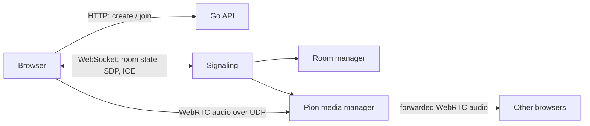

# Voiced

English | [简体中文](README.zh-CN.md)

Voiced is a temporary voice-room service. There are no accounts or login flow. A server-managed shared access token is required to create or join a room. Creating or joining gives the browser a `participantId` for its current session. Closing the page, leaving the room, or losing the WebSocket connection removes that participant. When the owner leaves, the longest-standing remaining participant becomes the owner. The room is deleted after its last participant leaves.

The backend is written in Go. The HTTP API creates and queries rooms, WebSocket carries room state and WebRTC signaling, and Pion forwards Opus/RTP audio on the server. The React and Vite frontend selects microphones, captures audio, and plays other participants' audio in the browser.

## Directories

| Path | Contents |
| --- | --- |
| `cmd/server` | Startup entry point for the HTTP, WebSocket, and media services |
| `internal/room` | Room and participant state, owner transfer, muting, and removal rules |
| `internal/api` | HTTP API, CORS, and JSON error responses |
| `internal/signaling` | WebSocket connections, authentication, and signaling messages |
| `internal/media` | Pion PeerConnections, ICE, and RTP audio forwarding |
| `frontend` | React UI, device selection, volume controls, and the WebRTC client |

## Request and audio flow



1. The browser creates or joins a room over HTTP and stores the returned `room` and `participant`.
2. It connects to `/ws/rooms/{roomId}`. Its first message must be `authenticate` with its `participantId`.
3. The server sends a room snapshot, then pushes joins, leaves, owner changes, and owner actions over WebSocket.
4. When a user enables the microphone, the browser gets an audio track with `getUserMedia`, changes its input level through an `AudioContext` `GainNode`, then adds the track to an `RTCPeerConnection`.
5. The browser and Pion exchange SDP offers, answers, and ICE candidates over WebSocket. Once connected, audio uses WebRTC UDP/DTLS/SRTP rather than WebSocket.
6. Pion reads RTP audio published by one participant and forwards it to other participants in the same room. It does not mix, record, or persist audio.

Remote volume and local mute affect only the current browser's `audio` element. An owner mute is enforced by the server: RTP from that participant is no longer forwarded to the room.

## Configuration and startup

Addresses and ports have no runtime defaults. Before starting, set a Go listen address and the permitted frontend Origin. The Vite development server also requires its own address, port, and backend address. The values in the example files are only examples to copy and modify.

```bash
cp .env.example .env
cp frontend/.env.example frontend/.env.local
```

Update the addresses and ports in both files. During development, `FRONTEND_ORIGIN` must exactly match the address used in the browser for Vite, for example `http://127.0.0.1:5173`. Start the services in two terminals:

Before the first start, create the server access token. The script writes it with owner-only permissions. Anyone who needs to create or join a room needs the value it prints.

```bash
bash scripts/set-access-token.sh --generate
```

```bash
# terminal 1
set -a
. ./.env
set +a
go run ./cmd/server
```

```bash
# terminal 2
cd frontend
npm install
npm run dev
```

The backend can also be configured entirely with command-line flags:

```bash
go run ./cmd/server \
  -listen-addr 127.0.0.1:8082 \
  -frontend-origin http://127.0.0.1:5173 \
  -access-token-file ./.runtime/access-token \
  -udp-port-min 40000 \
  -udp-port-max 40100 \
  -stun-urls stun:stun.l.google.com:19302
```

Command-line values override their matching environment variables.

| Flag | Environment variable | Purpose |
| --- | --- | --- |
| `-listen-addr` | `LISTEN_ADDR` | Go HTTP and WebSocket listen address, for example `0.0.0.0:8082` |
| `-frontend-origin` | `FRONTEND_ORIGIN` | Origins allowed to access the HTTP API and WebSocket; separate several values with commas |
| `-access-token-file` | `ACCESS_TOKEN_FILE` | File containing the shared token required for room creation and joining |
| `-udp-port-min` | `WEBRTC_UDP_PORT_MIN` | First port in Pion's UDP allocation range |
| `-udp-port-max` | `WEBRTC_UDP_PORT_MAX` | Last port in Pion's UDP allocation range |
| `-stun-urls` | `WEBRTC_STUN_URLS` | Comma-separated STUN URLs used for ICE candidate discovery |
| `-debug-media` | `VOICED_DEBUG` | Enables the read-only media debug endpoint |

Set both UDP limits or neither. When both are omitted, the operating system chooses UDP ports for Pion. STUN helps peers discover publicly reachable UDP addresses; it does not relay audio. Deployments across restrictive or symmetric NATs generally also need TURN. This service only publishes ICE URLs without credentials, so short-lived TURN credentials should be generated by the deployment environment.

## Access token

The access token protects `POST /api/rooms` and `POST /api/rooms/{roomId}/join`. The frontend submits it only with that request and does not store it in browser storage. The server reads `ACCESS_TOKEN_FILE` for every request, so updating the file rotates the token immediately without restarting the process:

```bash
# Enter a value without displaying it in the shell.
bash scripts/set-access-token.sh

# Or generate a replacement. Save the printed value before closing the terminal.
bash scripts/set-access-token.sh --generate

# Useful when a secret manager supplies the value.
printf '%s\n' 'a-token-from-your-secret-manager' | bash scripts/set-access-token.sh --stdin
```

The script replaces the file atomically and retains the existing owner and permissions when it replaces an existing file. A rotation applies to later create and join requests. It does not disconnect participants who are already in a room.

The token is sent in the JSON request body. Public HTTP transmits it in clear text, so HTTP-only remote development is not confidential. Use HTTPS or restrict access to a private network such as Tailscale when the token needs to protect a reachable service.

Browsers require HTTPS to access a microphone outside `localhost`; use WSS for the matching WebSocket connection. Before a production build, copy and edit `frontend/.env.production.example`, set `VITE_API_BASE_URL` and `VITE_WS_BASE_URL`, then run:

```bash
cd frontend
npm run build
```

Serve `frontend/dist` with a static file server and add the page Origin to `FRONTEND_ORIGIN`. Open the Go TCP listen port and the configured UDP range in the firewall.

## Remote development without a domain

The included scripts support an HTTP-only mode for testing the page, HTTP API, WebSocket, rooms, and owner actions. A public HTTP page cannot access the microphone, so it cannot test voice publishing or playback. For voice testing, enable the optional self-signed HTTPS configuration; HTTPS can use a high port and does not need to be 443. In both modes, the Go API stays on loopback behind Vite's proxy.

Create local, ignored configuration files with values suited to the VPS:

```dotenv
# .env
LISTEN_ADDR=127.0.0.1:18082
FRONTEND_ORIGIN=http://PUBLIC_IP:15173
ACCESS_TOKEN_FILE=./.runtime/access-token
WEBRTC_UDP_PORT_MIN=46100
WEBRTC_UDP_PORT_MAX=46199
WEBRTC_STUN_URLS=stun:stun.l.google.com:19302
VOICED_DEBUG=true
```

```dotenv
# frontend/.env.local
VITE_DEV_HOST=0.0.0.0
VITE_DEV_PORT=15173
VITE_BACKEND_URL=http://127.0.0.1:18082
VITE_API_BASE_URL=
VITE_WS_BASE_URL=
DEV_HTTPS_KEY_FILE=
DEV_HTTPS_CERT_FILE=
DEV_HTTPS_PUBLIC_NAME=PUBLIC_IP
NODE_BIN_DIR=/path/to/node/bin
```

Replace `PUBLIC_IP` and `NODE_BIN_DIR`. Create the access token before starting. With both `DEV_HTTPS_*_FILE` values empty, the script starts HTTP and does not create a certificate. It starts both processes with `nohup`:

```bash
bash scripts/set-access-token.sh --generate
bash scripts/start-remote-dev.sh
```

Open `http://PUBLIC_IP:15173` in the remote browser. Stop the processes and inspect their logs with:

```bash
bash scripts/stop-remote-dev.sh
tail -f .runtime/logs/backend.log
tail -f .runtime/logs/frontend.log
```

Allow TCP `15173` and UDP `46100-46199` in both the VPS firewall and the cloud provider's security-group or firewall rules. The frontend port and UDP range are examples; choose unused ports and keep the same values in the local configuration files.

To test the microphone later, set `FRONTEND_ORIGIN` to an `https://PUBLIC_IP:PORT` value, set both `DEV_HTTPS_KEY_FILE` and `DEV_HTTPS_CERT_FILE`, and choose the same Vite port. If the certificate files do not exist, `DEV_HTTPS_PUBLIC_NAME` makes the script create a 14-day self-signed certificate. Open the HTTPS address and explicitly accept the warning. A self-signed certificate is for debugging only; use a trusted certificate for a public service.

## HTTP API

All JSON requests require `Content-Type: application/json`. Error responses share this format:

```json
{
  "error": {
    "code": "INVALID_REQUEST",
    "message": "room name is required"
  }
}
```

`Room`:

```json
{
  "id": "room-id",
  "name": "Study room",
  "ownerParticipantId": "participant-id",
  "createdAt": "2026-09-09T12:00:00Z",
  "participantCount": 1
}
```

`Participant`:

```json
{
  "id": "participant-id",
  "nickname": "Alex",
  "joinedAt": "2026-09-09T12:00:00Z",
  "mutedByOwner": false
}
```

| Method and path | Request body | Successful response |
| --- | --- | --- |
| `GET /health` | None | `200 {"status":"ok"}` |
| `GET /api/rooms` | None | `200 Room[]` |
| `POST /api/rooms` | `{"name":"Study room","nickname":"Alex","token":"shared-token"}` | `201 {"room": Room, "participant": Participant}` |
| `GET /api/rooms/{roomId}` | None | `200 Room` |
| `POST /api/rooms/{roomId}/join` | `{"nickname":"Alex","token":"shared-token"}` | `200 {"room": Room, "participant": Participant}` |
| `GET /api/rooms/{roomId}/participants` | None | `200 Participant[]` |
| `GET /api/webrtc-config` | None | `200 {"iceServers":[{"urls":["stun:..."]}]}` |
| `GET /api/debug/media` | None | `200` media statistics; available only with `VOICED_DEBUG=true` or `-debug-media` |

The media debug response contains `udpPortMin`, `udpPortMax`, `peerCount`, and `publicationCount`. It reports state only; it cannot change UDP configuration while the process is running.

## WebSocket protocol

Connect to `ws(s)://<server>/ws/rooms/{roomId}`. Every message uses the same envelope:

```json
{
  "type": "message_type",
  "payload": {}
}
```

The first client message after connecting is:

```json
{
  "type": "authenticate",
  "payload": {"participantId":"participant-id"}
}
```

| Direction | `type` | `payload` |
| --- | --- | --- |
| client → server | `ping` | `null` |
| client → server | `leave` | `null` |
| client → server | `offer`, `answer` | WebRTC `RTCSessionDescriptionInit` |
| client → server | `ice_candidate` | WebRTC `RTCIceCandidateInit` |
| client → server | `mute_participant` | `{"targetParticipantId":"...","muted":true}`; owner only |
| client → server | `remove_participant` | `{"targetParticipantId":"..."}`; owner only |
| client → server | `dissolve_room` | `null`; owner only |
| server → client | `room_snapshot` | `{"room": Room, "participants": Participant[]}` |
| server → client | `participant_connected`, `participant_muted`, `participant_removed` | `Participant` |
| server → client | `participant_left` | `{"id":"participant-id"}` |
| server → client | `owner_changed` | `{"ownerParticipantId":"participant-id"}` |
| server → client | `offer`, `answer`, `ice_candidate` | Corresponding WebRTC data |
| server → client | `pong` | `null` |
| server → client | `error` | `{"code":"...","message":"..."}` |

The direction of `offer` and `answer` depends on the negotiation phase. The browser sends an offer when it starts publishing local audio and Pion replies with an answer. When Pion needs to add a forwarded remote track to the browser, Pion sends an offer and the browser replies with an answer.

## Verification

```bash
go test ./...
go vet ./...

cd frontend
npm run build
```

The Go media test opens local WebRTC UDP connections. Tests and builds do not start a persistent service. `frontend/dist` and the Vite cache are generated files and are ignored by `.gitignore`.

## License

Apache License 2.0. See [LICENSE](LICENSE).
