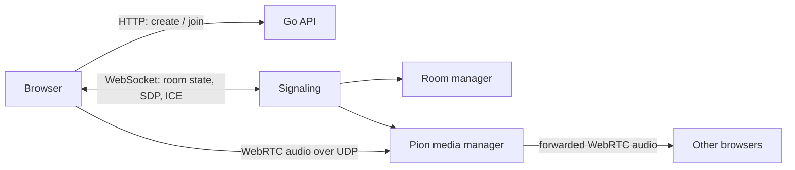

# Voiced

[English](README.md) | 简体中文

Voiced 是一个临时语音房服务。作为用户和管理员，都不需要注册和登录，但创建或加入房间需要输入服务端维护的共享访问令牌。创建或加入成功后，浏览器得到一个仅在当前会话中使用的 `participantId`。关闭页面、点击离开或 WebSocket 断开后，该成员会从房间删除。房主离开时，加入最早的剩余成员成为新房主；最后一个成员离开时，房间会删除。

服务端用 Go 编写。

HTTP API 负责创建和查询房间，WebSocket 负责房间状态和 WebRTC 信令。

Pion 在服务端转发 Opus/RTP 音频。

前端是 React 和 Vite，浏览器负责选麦克风、采集音频和播放其他成员的音频。

## 目录

| 路径 | 内容 |
| --- | --- |
| `cmd/server` | HTTP、WebSocket 和媒体服务的启动入口 |
| `internal/room` | 房间、成员、房主转移、禁言和移除规则 |
| `internal/api` | HTTP API、CORS 和 JSON 错误响应 |
| `internal/signaling` | WebSocket 连接、身份确认和信令消息 |
| `internal/media` | Pion PeerConnection、ICE 和 RTP 音频转发 |
| `frontend` | React 页面、设备选择、音量控制和 WebRTC 客户端 |

## 流程示例



1. 浏览器通过 HTTP 创建或加入房间，保存响应中的 `room` 和 `participant`。
2. 浏览器连接 `/ws/rooms/{roomId}`，第一条消息为 `authenticate`，其中包含 `participantId`，用以认证。
3. 服务端发送当前房间快照，并通过 WebSocket 推送成员加入、离开、房主变更和管理操作。
4. 用户启用麦克风后，浏览器用 `getUserMedia` 取得音轨，通过 `AudioContext` 的 `GainNode` 调整输入音量，再把音轨加入 `RTCPeerConnection`。
5. 浏览器和 Pion 通过 WebSocket 交换 SDP offer、answer 和 ICE candidate；在连接建立后，音频走 WebRTC 的 UDP/DTLS/SRTP 通道。
6. Pion 读取一个成员发布的 RTP 音频，并为同一房间中的其他成员转发。

用户的“音量”和“本地静音”只改变当前浏览器的 `audio` 元素，而相对的，房主的禁言是在服务端执行的，当房主禁言某一个成员后，该被禁言成员的 RTP 不再向房间转发，也就是服务端不会推送给其他成员。

## 配置和启动

端口和地址没有运行时默认值。

启动前必须给 Go 服务指定监听地址和允许的前端 Origin；Vite 开发服务器也必须指定自己的地址、端口和后端地址。仓库中的示例值仅用于复制后修改。

```bash
cp .env.example .env
cp frontend/.env.example frontend/.env.local
```

修改两个文件中的地址和端口。开发时，`FRONTEND_ORIGIN` 必须与浏览器实际访问 Vite 的地址一致，例如 `http://127.0.0.1:5173`。首次启动前先创建服务端访问令牌；脚本会以仅所有者可读写的权限保存它，之后需要把输出的值发给允许创建或加入房间的人。

```bash
bash scripts/set-access-token.sh --generate
```

然后在两个终端运行：

```bash
# terminal 1
set -a
. ./.env
set +a
go run ./cmd/server
```

```bash
# terminal 2
cd frontend
npm install
npm run dev
```

后端也可以完全用命令行参数启动：

```bash
go run ./cmd/server \
  -listen-addr 127.0.0.1:8082 \
  -frontend-origin http://127.0.0.1:5173 \
  -access-token-file ./.runtime/access-token \
  -udp-port-min 40000 \
  -udp-port-max 40100 \
  -stun-urls stun:stun.l.google.com:19302
```

命令行参数的值会覆盖同名环境变量。

| 参数 | 环境变量 | 作用 |
| --- | --- | --- |
| `-listen-addr` | `LISTEN_ADDR` | Go HTTP 和 WebSocket 监听地址，例如 `0.0.0.0:8082` |
| `-frontend-origin` | `FRONTEND_ORIGIN` | 允许访问 HTTP API 和 WebSocket 的 Origin；多个值用逗号分隔 |
| `-access-token-file` | `ACCESS_TOKEN_FILE` | 保存创建或加入房间所需共享令牌的文件 |
| `-udp-port-min` | `WEBRTC_UDP_PORT_MIN` | Pion 使用的 UDP 范围起始端口 |
| `-udp-port-max` | `WEBRTC_UDP_PORT_MAX` | Pion 使用的 UDP 范围结束端口 |
| `-stun-urls` | `WEBRTC_STUN_URLS` | 逗号分隔的 STUN URL |
| `-debug-media` | `VOICED_DEBUG` | 是否启用只读的媒体调试接口 |

UDP 起止端口必须同时设置，并且起始端口不能大于结束端口。两项都不设置时，由操作系统为 Pion 分配可用 UDP 端口。跨 NAT 部署通常还需要 TURN；当前接口只发布不含凭据的 ICE URL，TURN 的临时凭据应由部署环境另行生成。

## 访问令牌

访问令牌保护 `POST /api/rooms` 和 `POST /api/rooms/{roomId}/join`。前端只在创建或加入请求中提交令牌，不会把它保存到浏览器存储中。服务端会在每次请求时读取 `ACCESS_TOKEN_FILE`，因此可直接用脚本轮换令牌，无需重启服务：

```bash
# 在终端中输入令牌，输入时不会回显。
bash scripts/set-access-token.sh

# 或者生成一个新令牌。终端关闭前保存脚本输出的值。
bash scripts/set-access-token.sh --generate

# 由密钥管理工具提供令牌时可使用标准输入。
printf '%s\n' 'a-token-from-your-secret-manager' | bash scripts/set-access-token.sh --stdin
```

脚本会原子替换令牌文件；替换已有文件时会保留原有所有者和权限。轮换只影响之后的创建和加入请求，已经在房间内的成员不会被强制断开。

令牌位于 JSON 请求体中。公网 HTTP 会明文传输它，因此纯 HTTP 远程调试不具备保密性。令牌需要保护可访问服务时，应使用 HTTPS，或限制在 Tailscale 等私有网络中访问。

在公网中，浏览器访问页面需要 HTTPS 才能使用麦克风；对应的 WebSocket 地址应使用 WSS。生产构建前，复制并修改 `frontend/.env.production.example`，设置 `VITE_API_BASE_URL` 和 `VITE_WS_BASE_URL`，然后执行：

```bash
cd frontend
npm run build
```

将 `frontend/dist` 交给静态文件服务器，并把它的网页 Origin 加入 `FRONTEND_ORIGIN`。防火墙需要放行 Go 的 TCP 监听端口和配置的 UDP 范围。

## 没有域名时的远程调试

脚本支持纯 HTTP 模式，可测试页面、HTTP API、WebSocket、房间和房主管理操作。公网 HTTP 页面不能调用麦克风，因此不能测试语音发布和播放。需要测试语音时，再开启可选的自签名 HTTPS 配置；HTTPS 可以使用高端口，并不要求是 443。两种模式中，Go API 都只监听本机回环地址，通过 Vite 代理访问。

创建被 Git 忽略的本地配置文件，并填入 VPS 使用的值：

```dotenv
# .env
LISTEN_ADDR=127.0.0.1:18082
FRONTEND_ORIGIN=http://PUBLIC_IP:15173
ACCESS_TOKEN_FILE=./.runtime/access-token
WEBRTC_UDP_PORT_MIN=46100
WEBRTC_UDP_PORT_MAX=46199
WEBRTC_STUN_URLS=stun:stun.l.google.com:19302
VOICED_DEBUG=true
```

```dotenv
# frontend/.env.local
VITE_DEV_HOST=0.0.0.0
VITE_DEV_PORT=15173
VITE_BACKEND_URL=http://127.0.0.1:18082
VITE_API_BASE_URL=
VITE_WS_BASE_URL=
DEV_HTTPS_KEY_FILE=
DEV_HTTPS_CERT_FILE=
DEV_HTTPS_PUBLIC_NAME=PUBLIC_IP
NODE_BIN_DIR=/path/to/node/bin
```

替换 `PUBLIC_IP` 和 `NODE_BIN_DIR`。启动前创建访问令牌。两个 `DEV_HTTPS_*_FILE` 均为空时，脚本启动 HTTP，不会生成证书；它会使用 `nohup` 在后台启动两个进程：

```bash
bash scripts/set-access-token.sh --generate
bash scripts/start-remote-dev.sh
```

在远程浏览器打开 `http://PUBLIC_IP:15173`。可以用下面命令停止进程和查看日志：

```bash
bash scripts/stop-remote-dev.sh
tail -f .runtime/logs/backend.log
tail -f .runtime/logs/frontend.log
```

需要在 VPS 防火墙和云厂商安全组或防火墙中放行 TCP `15173` 和 UDP `46100-46199`。前端端口和 UDP 范围只是示例，可以换成未占用端口；两个本地配置文件中对应的值必须保持一致。

之后需要测试麦克风时，把 `FRONTEND_ORIGIN` 改为 `https://PUBLIC_IP:PORT`，设置 `DEV_HTTPS_KEY_FILE` 和 `DEV_HTTPS_CERT_FILE`，并让 Vite 使用相同端口。证书文件不存在时，`DEV_HTTPS_PUBLIC_NAME` 会让脚本生成一个包含该 IP 的 14 天自签名证书。打开 HTTPS 地址后手动接受告警即可。自签名证书只适用于调试，公开服务应使用受信任证书。

## HTTP API

所有 JSON 请求都需要 `Content-Type: application/json`。错误响应格式一致：

```json
{
  "error": {
    "code": "INVALID_REQUEST",
    "message": "room name is required"
  }
}
```

`Room`：

```json
{
  "id": "room-id",
  "name": "Study room",
  "ownerParticipantId": "participant-id",
  "createdAt": "2026-09-09T12:00:00Z",
  "participantCount": 1
}
```

`Participant`：

```json
{
  "id": "participant-id",
  "nickname": "Alex",
  "joinedAt": "2026-09-09T12:00:00Z",
  "mutedByOwner": false
}
```

| 方法和路径 | 请求体 | 成功响应 |
| --- | --- | --- |
| `GET /health` | 无 | `200 {"status":"ok"}` |
| `GET /api/rooms` | 无 | `200 Room[]` |
| `POST /api/rooms` | `{"name":"Study room","nickname":"Alex","token":"shared-token"}` | `201 {"room": Room, "participant": Participant}` |
| `GET /api/rooms/{roomId}` | 无 | `200 Room` |
| `POST /api/rooms/{roomId}/join` | `{"nickname":"Alex","token":"shared-token"}` | `200 {"room": Room, "participant": Participant}` |
| `GET /api/rooms/{roomId}/participants` | 无 | `200 Participant[]` |
| `GET /api/webrtc-config` | 无 | `200 {"iceServers":[{"urls":["stun:..."]}]}` |
| `GET /api/debug/media` | 无 | `200` 媒体统计；只在 `VOICED_DEBUG=true` 或 `-debug-media` 时可用 |


## WebSocket 协议

连接地址是 `ws(s)://<server>/ws/rooms/{roomId}`。每条消息使用相同信封：

```json
{
  "type": "message_type",
  "payload": {}
}
```

连接建立后的第一条客户端消息：

```json
{
  "type": "authenticate",
  "payload": {"participantId":"participant-id"}
}
```

| 方向 | `type` | `payload` |
| --- | --- | --- |
| client → server | `ping` | `null` |
| client → server | `leave` | `null` |
| client → server | `offer`、`answer` | WebRTC `RTCSessionDescriptionInit` |
| client → server | `ice_candidate` | WebRTC `RTCIceCandidateInit` |
| client → server | `mute_participant` | `{"targetParticipantId":"...","muted":true}`；仅房主 |
| client → server | `remove_participant` | `{"targetParticipantId":"..."}`；仅房主 |
| client → server | `dissolve_room` | `null`；仅房主 |
| server → client | `room_snapshot` | `{"room": Room, "participants": Participant[]}` |
| server → client | `participant_connected`、`participant_muted`、`participant_removed` | `Participant` |
| server → client | `participant_left` | `{"id":"participant-id"}` |
| server → client | `owner_changed` | `{"ownerParticipantId":"participant-id"}` |
| server → client | `offer`、`answer`、`ice_candidate` | 相应的 WebRTC 数据 |
| server → client | `pong` | `null` |
| server → client | `error` | `{"code":"...","message":"..."}` |

`offer` 和 `answer` 的方向取决于协商阶段：浏览器开始发布本地音频时发送 offer，Pion 回复 answer；当 Pion 需要给浏览器增加一个远端转发音轨时，Pion 会发送 offer，浏览器回复 answer。

## 验证

```bash
go test ./...
go vet ./...

cd frontend
npm run build
```

开发须知：
Go 的媒体测试会建立本机 WebRTC UDP 连接。测试和构建不会启动常驻服务；`frontend/dist` 和 Vite 缓存均为生成文件，已经被 `.gitignore` 忽略。

## License

Apache License 2.0，见 [LICENSE](LICENSE)。
